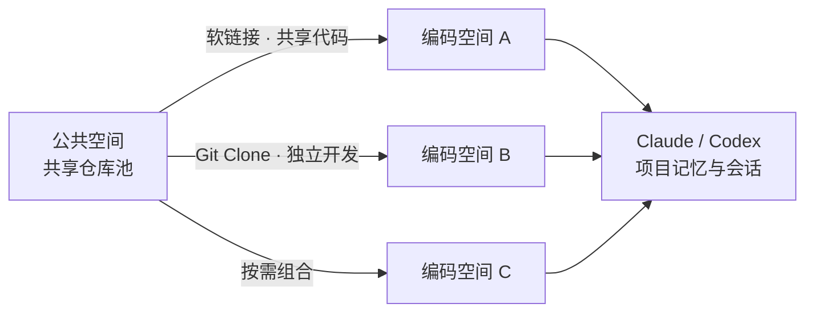

<p align="center">
  
</p>

<h1 align="center">Gojo</h1>

<p align="center">
  <strong>把散落的仓库，展开成你的 AI 编码领域。</strong>
</p>

<p align="center">
  
  
  
  
</p>

---

Gojo 是一款原生 macOS AI 编码空间管理器。它把公共仓库、独立工作区、Git 分支，以及 Claude Code / Codex 留下的项目记忆与历史会话，收进一个可视化的桌面应用里。

你可以把常用仓库集中放进「公共空间」，再通过 **Git 克隆**或**软链接**投放到不同的「编码空间」中。每个编码空间都是一套独立的开发上下文：需要隔离时就 clone，需要共享时就 link，不必再手动复制目录、寻找路径或记住每个终端窗口属于哪里。

## 「领域展开」

在五条悟老师的领域里，无限的信息会涌入意识；在 Gojo 的领域里，散落在文件夹、仓库、分支和 AI 会话中的上下文，会被收束成一个清晰、可操作的空间。

首页是一座编码空间展示柜。选中一个空间，卡片便向窗口铺开，成员仓库从中浮现——这就是 Gojo 对「领域展开」的理解：不是炫技式的皮肤，而是让每一次进入项目，都像真正切换到一片完整的工作领域。

> Gojo 是一个献给开发者与五条悟粉丝的非官方致敬项目，与《咒术回战》及其权利方不存在隶属或授权关系。

## 能力一览

### 🏯 一座展示柜，容纳多个编码领域

- 用焦点轮播浏览多个编码空间，空间内的仓库组成一眼可见
- 支持触控板横向滚动与键盘方向键切换焦点
- 从展示柜直接创建新的编码空间
- 深色「领域」视觉、焦点呼吸动画与展开转场
- 尊重 macOS 的「减弱动态效果」与辅助功能字体设置

### 🌐 公共空间：你的仓库术式库

- 指定一个文件夹作为所有共享仓库的公共空间
- 登记 Git 地址，按需 Clone，不强制立即下载
- 自动发现公共空间中已有的 Git 仓库
- 识别包含多个 Git 子仓库的复合文件夹，并可将子仓库提升为公共项目
- 搜索公共项目，查看已克隆与待同步状态
- 被编码空间引用的公共项目不会被误删

### 🌀 编码空间：按任务组织项目，而不是按磁盘找项目

- 首页可指定「编码空间根目录」，之后新建空间只需填名称，文件夹自动建在根目录下（重名自动加 _2、_3）
- 每个编码空间可以组合多个公共项目，也可以容纳独立 Git 仓库
- 自适应成员卡片展示仓库名称、来源形态与实时分支
- 从底部公共项目栏拖拽项目，通过双落区直接选择加入方式
- Clone、同步与模式切换在后台串行执行，并显示进行中状态
- 可从当前领域一键打开 Finder 或 Terminal、iTerm2、Warp、Otty；长按终端按钮可用转轮选择并固定偏好终端

### 🔀 Git 与软链接，双模式自由切换

| 模式 | 适合场景 | 行为 |
| --- | --- | --- |
| **Git 克隆** | 需要独立分支、独立修改、并行开发 | 在编码空间内创建独立仓库副本 |
| **软链接** | 只需共享同一份代码、节省磁盘空间 | 指向公共空间中的仓库，不重复存储 |

已加入的公共项目可以在两种模式之间切换。Git 模式支持拉取同步与分支切换；切回软链接前，Gojo 会检查未提交和未推送的改动并给出警告。

### 🧠 找回 AI 助手的记忆

- 读取当前项目的 Claude Code `memory/*.md`
- 汇总 Claude Code 与 Codex 的历史会话
- 按项目路径匹配会话，兼容软链接的真实路径
- 展示会话标题与最近使用时间
- 点击历史会话，在偏好的终端中直接执行 `claude --resume` 或 `codex resume`

Gojo 只读取本机已有的助手数据；没有使用过对应助手时，会显示清晰的空状态。

### 🛡️ 对删除保持克制

- 删除公共项目时先检查它是否仍被编码空间引用
- 移除编码空间时，可以只取消登记，也可以将整个空间逐项移入 macOS 废纸篓
- 对根目录、用户主目录和未登记路径设置破坏性操作保护
- 清理软链接成员时不会删除公共仓库本体
- 所有清单采用原子写入，耗时的工作区操作串行执行，避免并发覆盖

## 它是怎样工作的？



Gojo 不会接管你的 Git 仓库，也不要求特殊的工程格式。它只在所选目录中维护轻量的 `.gojo` 清单，并在用户应用支持目录中保存中央索引：

```text
~/Library/Application Support/Gojo/index.json
公共空间/.gojo/public.json
编码空间/.gojo/workspace.json
```

仓库依然是普通文件夹，可以继续被 Git、IDE、终端和其他工具直接使用。

## 快速开始

### 方式一：下载 DMG（无需开发环境）

1. 从 [Releases](https://github.com/CodeFancier/Gojo/releases) 下载最新的 `Gojo-x.x.x.dmg`。
2. 打开镜像，把 Gojo 拖入「应用程序」文件夹。
3. 首次打开需要放行未知开发者：Gojo 目前只做本地 ad-hoc 签名，未经 Apple 公证，Gatekeeper 会提示「无法验证开发者」。在 Finder 中右键 Gojo 选择「打开」，或到「系统设置 → 隐私与安全性」点击「仍要打开」，之后即可正常启动。

### 方式二：用脚本本地打包

需要 macOS 13+、Xcode（含命令行工具）与 Git：

```bash
git clone https://github.com/CodeFancier/Gojo.git
cd Gojo
./Scripts/package-app.sh
open build/Gojo.app
```

脚本会执行 Release 构建、组装 `Gojo.app` 并进行本地 ad-hoc 签名。开发调试可用 `swift run` 直接从源码启动，`swift test` 运行测试；需要分发镜像时用 `./Scripts/make-dmg.sh` 生成 DMG。

### 首次进入

1. 打开底部的「公共空间」，指定一个用于集中保存共享仓库的文件夹。
2. 添加仓库名称与 Git URL，并在需要时点击 Clone。
3. 返回展示柜，通过末尾的 `+` 卡片创建一个编码空间。
4. 进入编码空间，搜索并拖起公共项目。
5. 投放到「Git 克隆」或「软链接」区域，完成领域编排。
6. 在成员卡片上同步、切换分支、转换模式，或打开 Claude / Codex 历史会话。

## 常用操作

| 想做什么 | 在 Gojo 中怎么做 |
| --- | --- |
| 为新任务准备一组仓库 | 新建编码空间，从公共项目栏拖入所需项目 |
| 同一仓库同时开发多个分支 | 分别以 Git 模式加入不同编码空间 |
| 多个空间共享一份只读或同步代码 | 以软链接模式加入 |
| 拉取远端更新 | 悬停 Git 成员卡片，点击同步 |
| 切换分支 | 悬停 Git 成员卡片，打开分支选择器 |
| 恢复 AI 编码现场 | 点击成员卡片或领域顶栏中的 Claude / Codex 按钮 |
| 直接进入命令行或文件目录 | 使用领域顶栏的终端 / Finder 按钮 |
| 移除一个编码空间 | 拖动空间卡片到垃圾桶图标，选择只取消登记或移入废纸篓 |

## 当前状态

Gojo 目前处于 `0.1.x` 早期开发阶段，核心工作流已经可用，但界面、清单结构和分发方式仍可能继续演进。建议先在可恢复的仓库与目录中体验，并照常保持 Git 提交和重要文件备份。

如果你也想拥有一片更清晰的编码领域，欢迎试用、提出建议，或一起完善它。
